# Flujos de Llamadas a API - Cliente Web

Documento que detalla el flujo de todas las llamadas a la API del backend para las operaciones principales en aplicaciones web (React, Vue, Angular, etc.).

---

## Diferencias Clave: Web vs Mobile

| Aspecto | Web | Mobile |
|---------|-----|--------|
| Header | `X-Client-Type: web` | `X-Client-Type: mobile` |
| Refresh Token | Cookie httpOnly (automático) | JSON response (manual) |
| Device ID | UUID en localStorage | ID nativo del dispositivo |
| Credenciales | `credentials: 'include'` | Header manual |

---

## Configuración Inicial: Device ID

En web no existe un identificador nativo del dispositivo como en mobile. Se recomienda generar un UUID y almacenarlo en `localStorage`:

```javascript
function getDeviceId() {
  const STORAGE_KEY = 'deviceId'
  let deviceId = localStorage.getItem(STORAGE_KEY)

  if (!deviceId) {
    deviceId = crypto.randomUUID()
    localStorage.setItem(STORAGE_KEY, deviceId)
  }

  return deviceId
}
```

**Consideraciones:**
- El `deviceId` se pierde si el usuario limpia el localStorage o usa modo incógnito
- En modo incógnito se generará un nuevo `deviceId` por sesión
- Si se requiere mayor persistencia, considerar librerías de fingerprinting como [FingerprintJS](https://fingerprint.com/)

---

## 1. Flujo de Autenticación (Login)

### Descripción General
El usuario inicia sesión con sus credenciales. A diferencia de mobile, el refresh token se almacena automáticamente en una cookie httpOnly (más seguro contra XSS).

### Diagrama de Secuencia

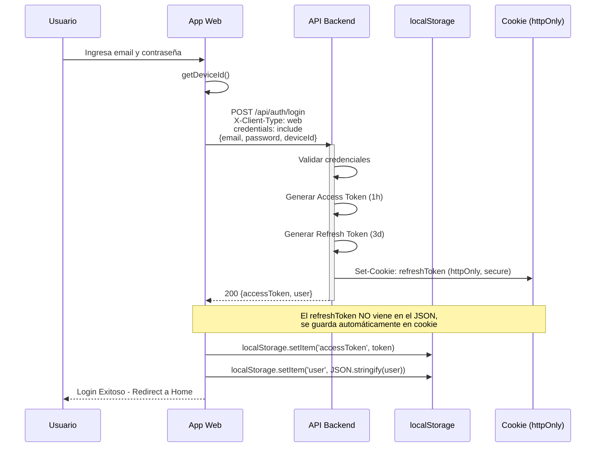
```mermaid
sequenceDiagram
    participant User as Usuario
    participant App as App Web
    participant API as API Backend
    participant Storage as localStorage
    participant Cookie as Cookie (httpOnly)

    User->>App: Ingresa email y contraseña
    App->>App: getDeviceId()
    App->>API: POST /api/auth/login<br/>X-Client-Type: web<br/>credentials: include<br/>{email, password, deviceId}
    activate API
    API->>API: Validar credenciales
    API->>API: Generar Access Token (1h)
    API->>API: Generar Refresh Token (3d)
    API->>Cookie: Set-Cookie: refreshToken (httpOnly, secure)
    API-->>App: 200 {accessToken, user}
    deactivate API

    Note over App,Cookie: El refreshToken NO viene en el JSON,<br/>se guarda automáticamente en cookie

    App->>Storage: localStorage.setItem('accessToken', token)
    App->>Storage: localStorage.setItem('user', JSON.stringify(user))

    App-->>User: Login Exitoso - Redirect a Home
```

### Tabla de Detalles

| Endpoint | Método | Headers Requeridos |
|----------|--------|-------------------|
| `POST /api/auth/login` | POST | `Content-Type: application/json`<br/>`X-Client-Type: web` |

### Request Body
```json
{
  "email": "usuario@ejemplo.com",
  "password": "contraseña123",
  "deviceId": "uuid-generado-localmente"
}
```

### Response 200
```json
{
  "message": "Login successful",
  "accessToken": "eyJhbGciOiJIUzI1NiIsInR5cCI6IkpXVCJ9...",
  "user": {
    "userId": 1,
    "email": "usuario@ejemplo.com",
    "names": "Juan",
    "lastnames": "Pérez",
    "role": "user"
  }
}
```

**Nota:** El `refreshToken` NO viene en el JSON para web, se establece automáticamente como cookie httpOnly.

---

## 2. Flujo de Refresh Token

### Descripción General
El refresh token se maneja automáticamente via cookies httpOnly:
- El navegador lo envía automáticamente con `credentials: 'include'`
- No es accesible desde JavaScript (protección contra XSS)
- Se renueva automáticamente en cada refresh

### Diagrama de Secuencia

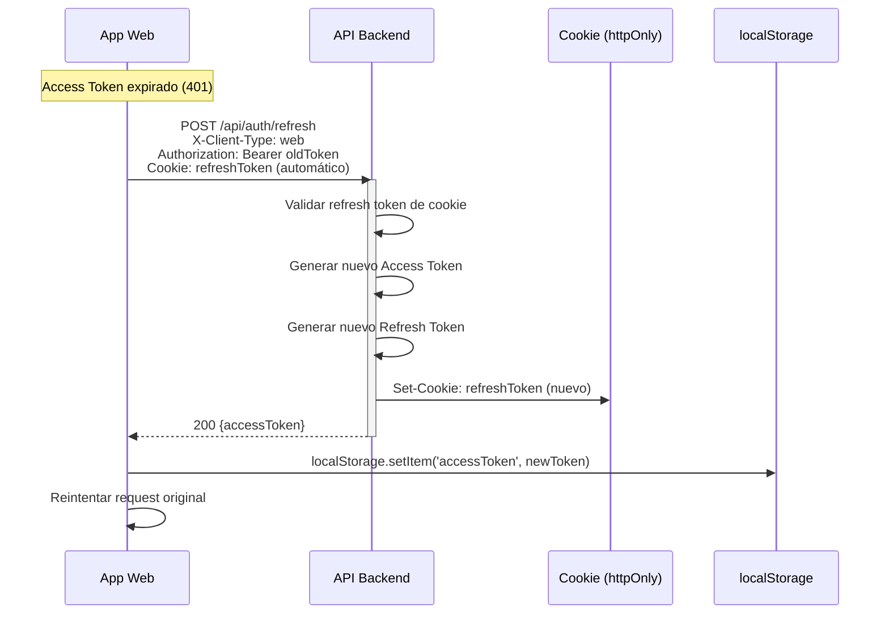
```mermaid
sequenceDiagram
    participant App as App Web
    participant API as API Backend
    participant Cookie as Cookie (httpOnly)
    participant Storage as localStorage

    Note over App: Access Token expirado (401)

    App->>API: POST /api/auth/refresh<br/>X-Client-Type: web<br/>Authorization: Bearer oldToken<br/>Cookie: refreshToken (automático)
    activate API
    API->>API: Validar refresh token de cookie
    API->>API: Generar nuevo Access Token
    API->>API: Generar nuevo Refresh Token
    API->>Cookie: Set-Cookie: refreshToken (nuevo)
    API-->>App: 200 {accessToken}
    deactivate API

    App->>Storage: localStorage.setItem('accessToken', newToken)
    App->>App: Reintentar request original
```

### Tabla de Detalles

| Endpoint | Método | Headers Requeridos |
|----------|--------|-------------------|
| `POST /api/auth/refresh` | POST | `Content-Type: application/json`<br/>`X-Client-Type: web`<br/>`Authorization: Bearer <token>` |

### Response 200
```json
{
  "message": "Token refreshed successfully",
  "accessToken": "eyJhbGciOiJIUzI1NiIsInR5cCI6IkpXVCJ9..."
}
```

---

## 3. Flujo de Logout

### Diagrama de Secuencia

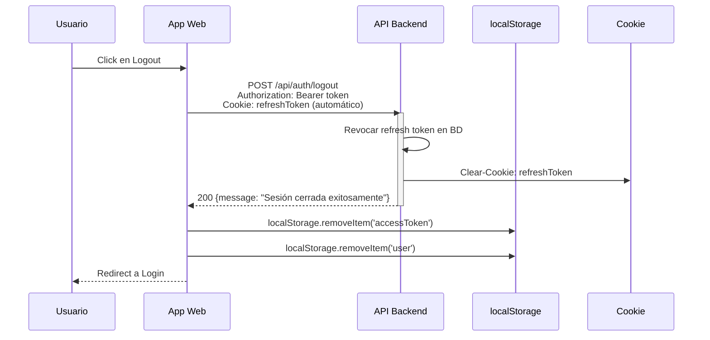
```mermaid
sequenceDiagram
    participant User as Usuario
    participant App as App Web
    participant API as API Backend
    participant Storage as localStorage
    participant Cookie as Cookie

    User->>App: Click en Logout
    App->>API: POST /api/auth/logout<br/>Authorization: Bearer token<br/>Cookie: refreshToken (automático)
    activate API
    API->>API: Revocar refresh token en BD
    API->>Cookie: Clear-Cookie: refreshToken
    API-->>App: 200 {message: "Sesión cerrada exitosamente"}
    deactivate API

    App->>Storage: localStorage.removeItem('accessToken')
    App->>Storage: localStorage.removeItem('user')
    App-->>User: Redirect a Login
```

---

## 4. Flujo de Registro

### Diagrama de Secuencia

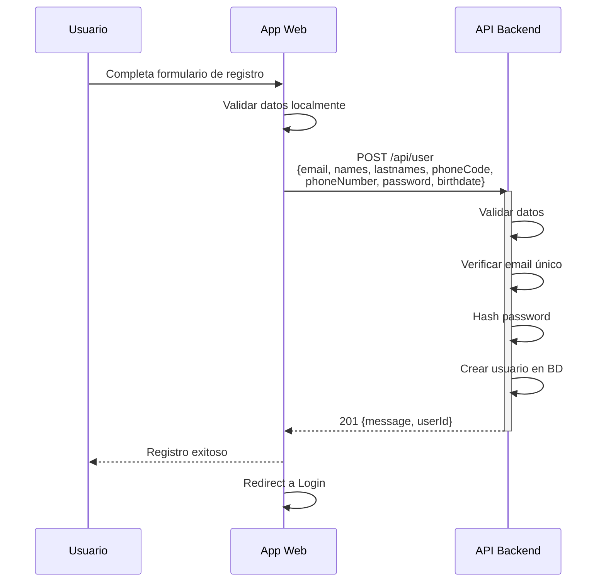
```mermaid
sequenceDiagram
    participant User as Usuario
    participant App as App Web
    participant API as API Backend

    User->>App: Completa formulario de registro
    App->>App: Validar datos localmente
    App->>API: POST /api/user<br/>{email, names, lastnames, phoneCode,<br/>phoneNumber, password, birthdate}
    activate API
    API->>API: Validar datos
    API->>API: Verificar email único
    API->>API: Hash password
    API->>API: Crear usuario en BD
    API-->>App: 201 {message, userId}
    deactivate API

    App-->>User: Registro exitoso
    App->>App: Redirect a Login
```

### Request Body
```json
{
  "email": "nuevo@ejemplo.com",
  "names": "María",
  "lastnames": "García López",
  "password": "contraseña123",
  "phoneNumber": "12345678",
  "phoneCode": "+502",
  "birthdate": "2000-05-15"
}
```

---

## 5. Flujo de Recuperación de Contraseña

### Diagrama de Secuencia

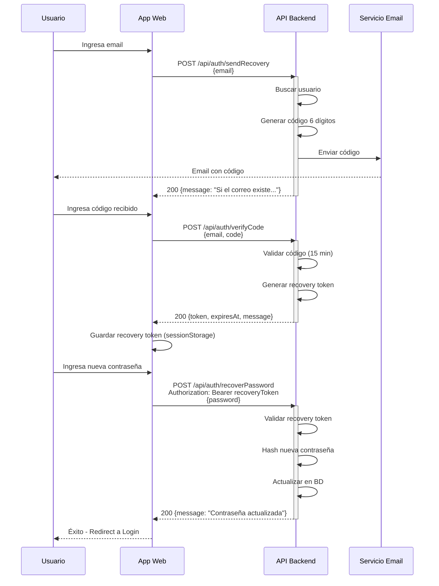
```mermaid
sequenceDiagram
    participant User as Usuario
    participant App as App Web
    participant API as API Backend
    participant Email as Servicio Email

    User->>App: Ingresa email
    App->>API: POST /api/auth/sendRecovery<br/>{email}
    activate API
    API->>API: Buscar usuario
    API->>API: Generar código 6 dígitos
    API->>Email: Enviar código
    Email-->>User: Email con código
    API-->>App: 200 {message: "Si el correo existe..."}
    deactivate API

    User->>App: Ingresa código recibido
    App->>API: POST /api/auth/verifyCode<br/>{email, code}
    activate API
    API->>API: Validar código (15 min)
    API->>API: Generar recovery token
    API-->>App: 200 {token, expiresAt, message}
    deactivate API

    App->>App: Guardar recovery token (sessionStorage)

    User->>App: Ingresa nueva contraseña
    App->>API: POST /api/auth/recoverPassword<br/>Authorization: Bearer recoveryToken<br/>{password}
    activate API
    API->>API: Validar recovery token
    API->>API: Hash nueva contraseña
    API->>API: Actualizar en BD
    API-->>App: 200 {message: "Contraseña actualizada"}
    deactivate API

    App-->>User: Éxito - Redirect a Login
```

### Tabla de Detalles

| Paso | Endpoint | Método |
|------|----------|--------|
| 1. Solicitar código | `POST /api/auth/sendRecovery` | POST |
| 2. Verificar código | `POST /api/auth/verifyCode` | POST |
| 3. Nueva contraseña | `POST /api/auth/recoverPassword` | POST |

---

## 6. Flujo de Creación de Chats

### Diagrama de Secuencia

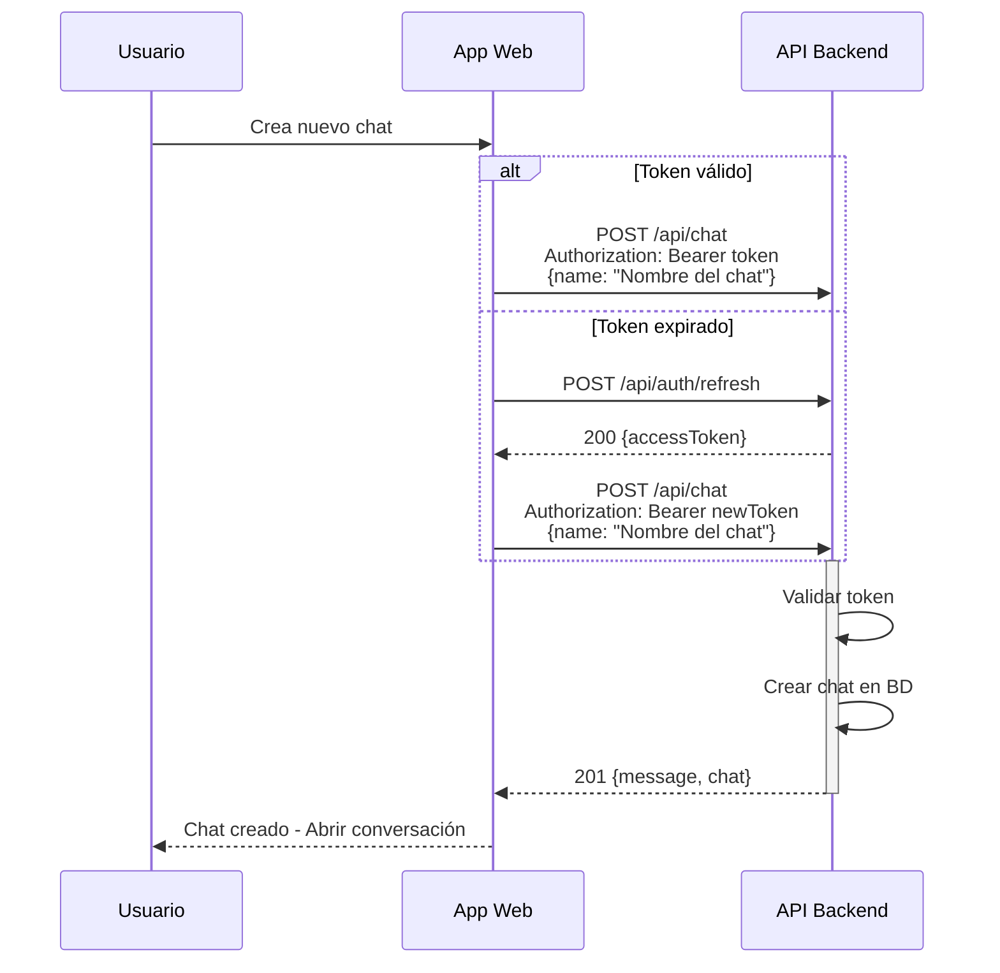
```mermaid
sequenceDiagram
    participant User as Usuario
    participant App as App Web
    participant API as API Backend

    User->>App: Crea nuevo chat

    alt Token válido
        App->>API: POST /api/chat<br/>Authorization: Bearer token<br/>{name: "Nombre del chat"}
    else Token expirado
        App->>API: POST /api/auth/refresh
        API-->>App: 200 {accessToken}
        App->>API: POST /api/chat<br/>Authorization: Bearer newToken<br/>{name: "Nombre del chat"}
    end

    activate API
    API->>API: Validar token
    API->>API: Crear chat en BD
    API-->>App: 201 {message, chat}
    deactivate API

    App-->>User: Chat creado - Abrir conversación
```

### Request Body
```json
{
  "name": "Consulta sobre trámites"
}
```

### Response 201
```json
{
  "message": "Chat creado exitosamente",
  "chat": {
    "chatId": 5,
    "userId": 1,
    "nombre": "Consulta sobre trámites",
    "fechaInicio": "2026-01-12T10:30:00.000Z"
  }
}
```

---

## 7. Flujo de Obtener Chats

### Diagrama de Secuencia

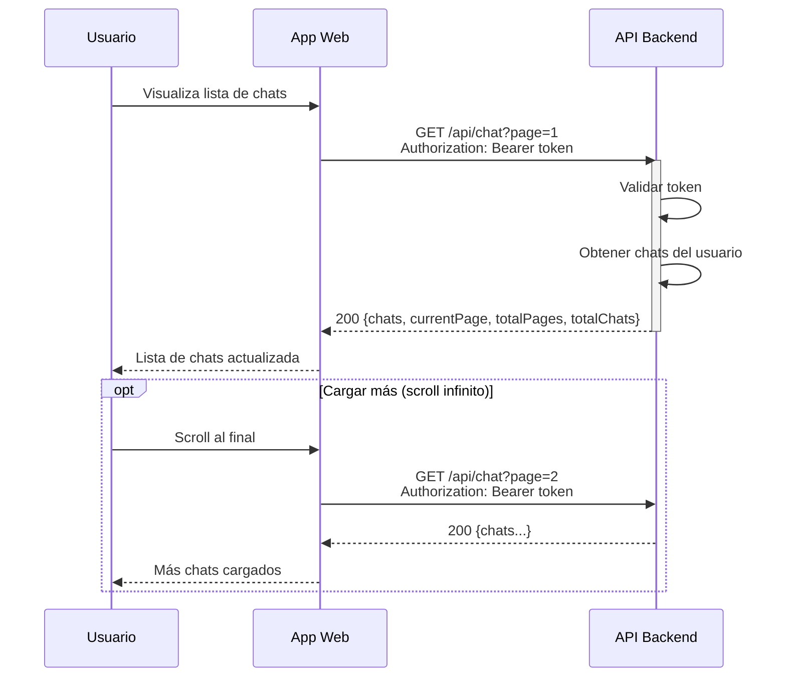
```mermaid
sequenceDiagram
    participant User as Usuario
    participant App as App Web
    participant API as API Backend

    User->>App: Visualiza lista de chats

    App->>API: GET /api/chat?page=1<br/>Authorization: Bearer token
    activate API
    API->>API: Validar token
    API->>API: Obtener chats del usuario
    API-->>App: 200 {chats, currentPage, totalPages, totalChats}
    deactivate API

    App-->>User: Lista de chats actualizada

    opt Cargar más (scroll infinito)
        User->>App: Scroll al final
        App->>API: GET /api/chat?page=2<br/>Authorization: Bearer token
        API-->>App: 200 {chats...}
        App-->>User: Más chats cargados
    end
```

### Response 200
```json
{
  "chats": [
    {
      "chatId": 5,
      "userId": 1,
      "nombre": "Consulta sobre trámites",
      "fechaInicio": "2026-01-12T10:30:00.000Z",
      "lastMessageContent": "¿Cómo solicito mi DPI?",
      "lastMessageTimestamp": "2026-01-12T10:45:00.000Z",
      "lastMessageSource": "user"
    }
  ],
  "currentPage": 1,
  "totalPages": 3,
  "totalChats": 25
}
```

---

## 8. Flujo de Mensajes en Chats

### 8.1 Obtener Mensajes de un Chat

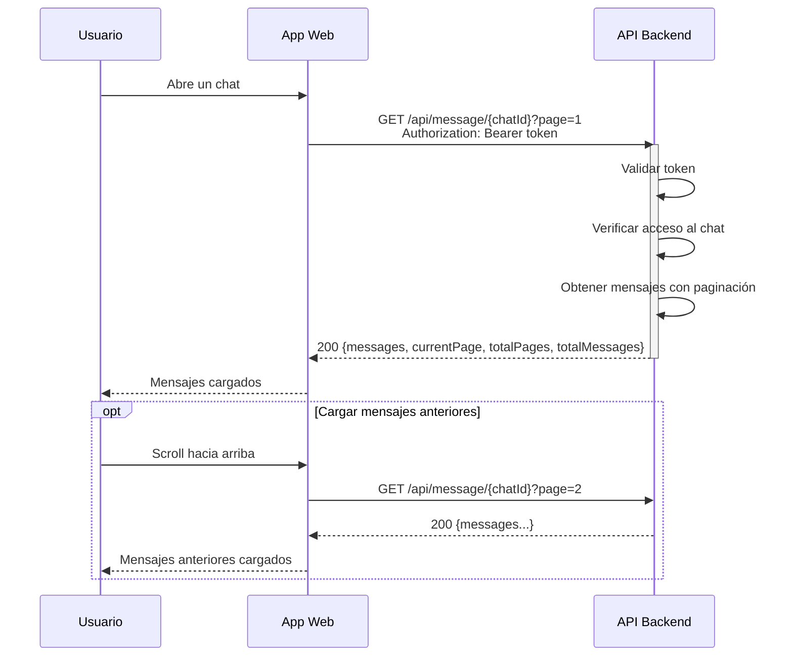
```mermaid
sequenceDiagram
    participant User as Usuario
    participant App as App Web
    participant API as API Backend

    User->>App: Abre un chat

    App->>API: GET /api/message/{chatId}?page=1<br/>Authorization: Bearer token
    activate API
    API->>API: Validar token
    API->>API: Verificar acceso al chat
    API->>API: Obtener mensajes con paginación
    API-->>App: 200 {messages, currentPage, totalPages, totalMessages}
    deactivate API

    App-->>User: Mensajes cargados

    opt Cargar mensajes anteriores
        User->>App: Scroll hacia arriba
        App->>API: GET /api/message/{chatId}?page=2
        API-->>App: 200 {messages...}
        App-->>User: Mensajes anteriores cargados
    end
```

### 8.2 Crear Mensaje en Chat

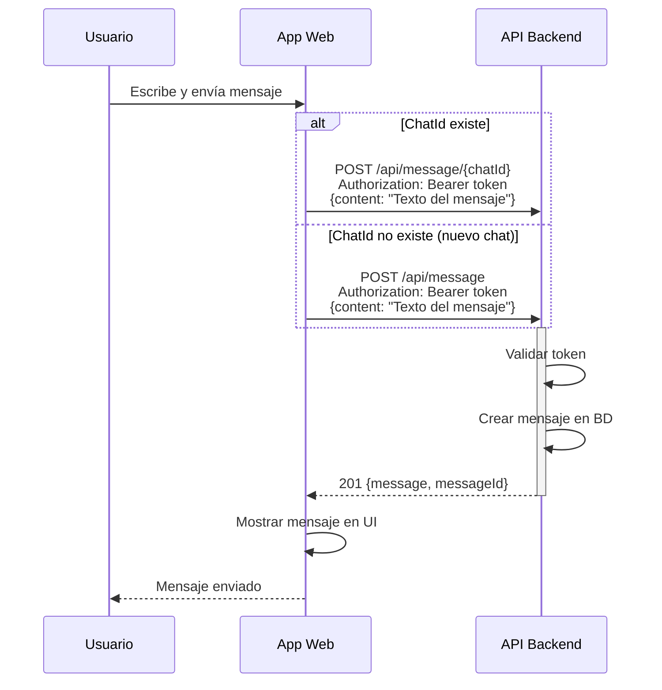
```mermaid
sequenceDiagram
    participant User as Usuario
    participant App as App Web
    participant API as API Backend

    User->>App: Escribe y envía mensaje

    alt ChatId existe
        App->>API: POST /api/message/{chatId}<br/>Authorization: Bearer token<br/>{content: "Texto del mensaje"}
    else ChatId no existe (nuevo chat)
        App->>API: POST /api/message<br/>Authorization: Bearer token<br/>{content: "Texto del mensaje"}
    end

    activate API
    API->>API: Validar token
    API->>API: Crear mensaje en BD
    API-->>App: 201 {message, messageId}
    deactivate API

    App->>App: Mostrar mensaje en UI
    App-->>User: Mensaje enviado
```

### 8.3 Obtener Respuesta de IA

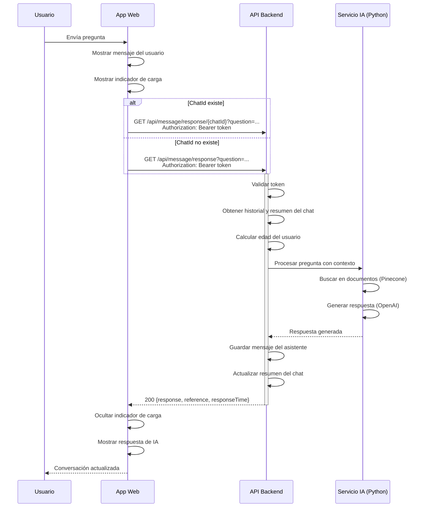
```mermaid
sequenceDiagram
    participant User as Usuario
    participant App as App Web
    participant API as API Backend
    participant AI as Servicio IA (Python)

    User->>App: Envía pregunta
    App->>App: Mostrar mensaje del usuario
    App->>App: Mostrar indicador de carga

    alt ChatId existe
        App->>API: GET /api/message/response/{chatId}?question=...<br/>Authorization: Bearer token
    else ChatId no existe
        App->>API: GET /api/message/response?question=...<br/>Authorization: Bearer token
    end

    activate API
    API->>API: Validar token
    API->>API: Obtener historial y resumen del chat
    API->>API: Calcular edad del usuario
    API->>AI: Procesar pregunta con contexto
    AI->>AI: Buscar en documentos (Pinecone)
    AI->>AI: Generar respuesta (OpenAI)
    AI-->>API: Respuesta generada
    API->>API: Guardar mensaje del asistente
    API->>API: Actualizar resumen del chat
    API-->>App: 200 {response, reference, responseTime}
    deactivate API

    App->>App: Ocultar indicador de carga
    App->>App: Mostrar respuesta de IA
    App-->>User: Conversación actualizada
```

### 8.4 Asignar Mensaje a Chat

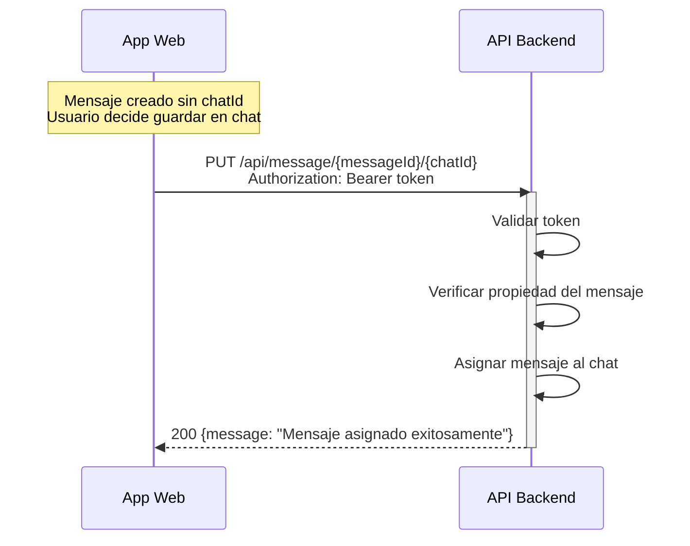
```mermaid
sequenceDiagram
    participant App as App Web
    participant API as API Backend

    Note over App: Mensaje creado sin chatId<br/>Usuario decide guardar en chat

    App->>API: PUT /api/message/{messageId}/{chatId}<br/>Authorization: Bearer token
    activate API
    API->>API: Validar token
    API->>API: Verificar propiedad del mensaje
    API->>API: Asignar mensaje al chat
    API-->>App: 200 {message: "Mensaje asignado exitosamente"}
    deactivate API
```

### Tabla de Detalles de Endpoints de Mensajes

| Endpoint | Método | Descripción |
|----------|--------|-------------|
| `GET /api/message/{chatId}` | GET | Obtiene mensajes del chat (paginado) |
| `POST /api/message/{chatId}` | POST | Crea mensaje en chat existente |
| `POST /api/message` | POST | Crea mensaje sin chat asignado |
| `GET /api/message/response/{chatId}` | GET | Obtiene respuesta IA para chat |
| `GET /api/message/response` | GET | Obtiene respuesta IA sin chat |
| `PUT /api/message/{messageId}/{chatId}` | PUT | Asigna mensaje a chat |

---

## 9. Flujo de Documentos (Solo Admin)

### 9.1 Obtener Documentos

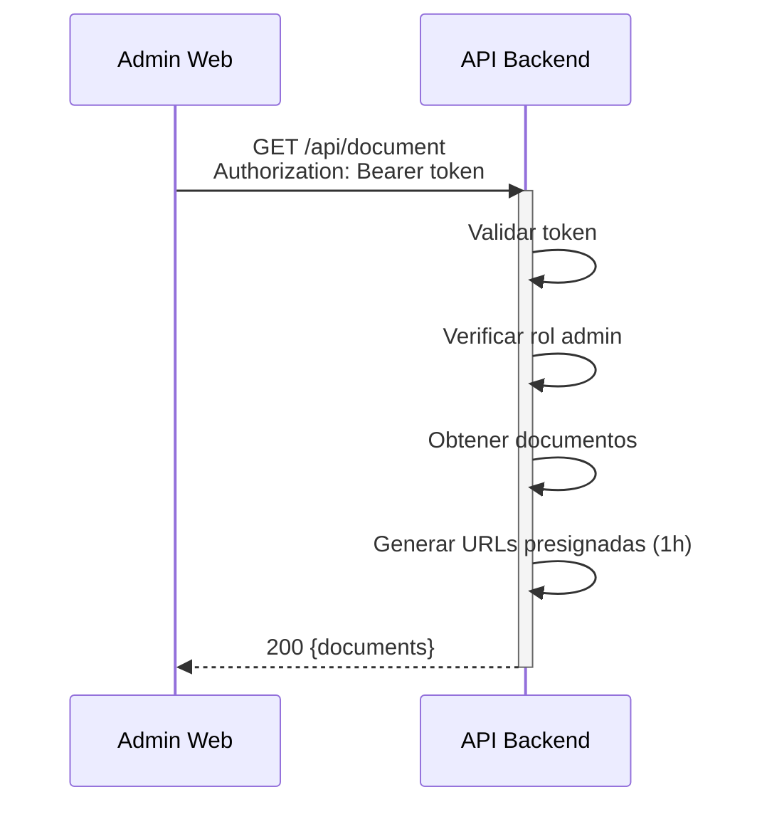
```mermaid
sequenceDiagram
    participant Admin as Admin Web
    participant API as API Backend

    Admin->>API: GET /api/document<br/>Authorization: Bearer token
    activate API
    API->>API: Validar token
    API->>API: Verificar rol admin
    API->>API: Obtener documentos
    API->>API: Generar URLs presignadas (1h)
    API-->>Admin: 200 {documents}
    deactivate API
```

### 9.2 Subir Documento

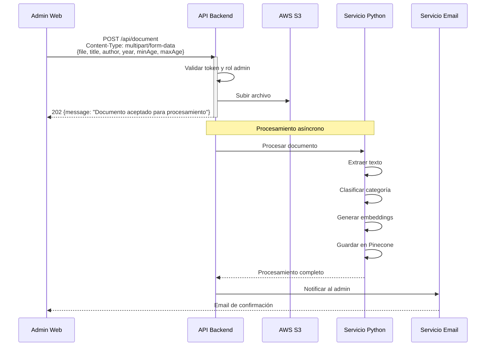
```mermaid
sequenceDiagram
    participant Admin as Admin Web
    participant API as API Backend
    participant S3 as AWS S3
    participant Python as Servicio Python
    participant Email as Servicio Email

    Admin->>API: POST /api/document<br/>Content-Type: multipart/form-data<br/>{file, title, author, year, minAge, maxAge}
    activate API
    API->>API: Validar token y rol admin
    API->>S3: Subir archivo
    API-->>Admin: 202 {message: "Documento aceptado para procesamiento"}
    deactivate API

    Note over API,Python: Procesamiento asíncrono

    API->>Python: Procesar documento
    Python->>Python: Extraer texto
    Python->>Python: Clasificar categoría
    Python->>Python: Generar embeddings
    Python->>Python: Guardar en Pinecone
    Python-->>API: Procesamiento completo

    API->>Email: Notificar al admin
    Email-->>Admin: Email de confirmación
```

### 9.3 Eliminar Documento

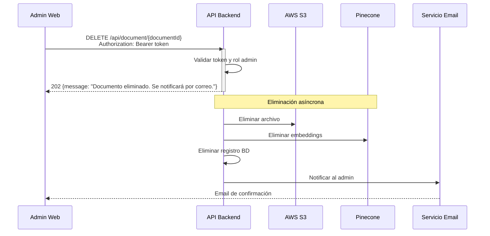
```mermaid
sequenceDiagram
    participant Admin as Admin Web
    participant API as API Backend
    participant S3 as AWS S3
    participant Pinecone as Pinecone
    participant Email as Servicio Email

    Admin->>API: DELETE /api/document/{documentId}<br/>Authorization: Bearer token
    activate API
    API->>API: Validar token y rol admin
    API-->>Admin: 202 {message: "Documento eliminado. Se notificará por correo."}
    deactivate API

    Note over API,Pinecone: Eliminación asíncrona

    API->>S3: Eliminar archivo
    API->>Pinecone: Eliminar embeddings
    API->>API: Eliminar registro BD

    API->>Email: Notificar al admin
    Email-->>Admin: Email de confirmación
```

---

## Resumen de Endpoints

| Endpoint | Método | Auth | Descripción |
|----------|--------|------|-------------|
| `/api/auth/login` | POST | No | Login |
| `/api/auth/refresh` | POST | Si | Refrescar token |
| `/api/auth/logout` | POST | Si | Cerrar sesión |
| `/api/auth/sendRecovery` | POST | No | Enviar código recuperación |
| `/api/auth/verifyCode` | POST | No | Verificar código |
| `/api/auth/recoverPassword` | POST | Recovery Token | Nueva contraseña |
| `/api/user` | POST | No | Registro |
| `/api/user/logged` | GET | Si | Usuario actual |
| `/api/user/:userId` | PUT | Si | Actualizar perfil |
| `/api/chat` | GET | Si | Listar chats |
| `/api/chat` | POST | Si | Crear chat |
| `/api/message/:chatId` | GET | Si | Listar mensajes |
| `/api/message/:chatId` | POST | Si | Crear mensaje |
| `/api/message` | POST | Si | Crear mensaje sin chat |
| `/api/message/response/:chatId` | GET | Si | Respuesta IA |
| `/api/message/response` | GET | Si | Respuesta IA sin chat |
| `/api/message/:messageId/:chatId` | PUT | Si | Asignar mensaje a chat |
| `/api/document` | GET | Admin | Listar documentos |
| `/api/document` | POST | Admin | Subir documento |
| `/api/document/:documentId` | DELETE | Admin | Eliminar documento |

---

## Notas Importantes para Web

1. **Siempre usar `credentials: 'include'`** en todas las requests para que el navegador envíe/reciba cookies
2. **El refreshToken nunca es accesible desde JavaScript** - está en una cookie httpOnly
3. **Manejar 401 automáticamente** - intentar refresh antes de redirigir a login
4. **deviceId en localStorage** - se pierde en incógnito o al limpiar datos

---

**Última actualización**: 21 de enero de 2026
**Versión**: 1.0
